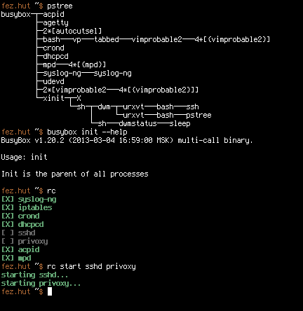

minirc - minimalistic rc script
===============================

The script "rc" is a minimalistic init script made for use with busybox init.
It starts up udev, sets the hostname, mounts the file systems, starts the
daemons and so on.

Later, in the user space, you can use it to list currently running daemons and
individually start or stop them.

It was developed for arch linux to get rid of systemd, but it can probably run
on other distributions as well.

Installing
----------

Dependencies: busybox, optionally eudev or systemd (for udev)

NOTE: The archlinux AUR package does step 1 for you.

1. There is a setup.sh script, but you should read it first.  If you don't use
a package manager which does the sanity checks for you, please check for
yourself that it doesn't break your system by overwriting essential files.
Make backups as needed.

When you are confident, run "./setup.sh --force"

2. Remove "init=..." from your kernel parameters (if it is there) so that the
default value "init=/sbin/init" is used.  Check the docs of your boot loader on
how to change the kernel parameters.

3. Configure /etc/minirc.conf to your needs.
See sections "Dealing with services" and "Further configuration".

4. Reboot

Shutdown & Reboot
-----------------

You need to use busybox's version of the reboot command by either typing in
"busybox reboot" or by linking busybox to /bin/reboot and executing it.
The same goes for "halt" and "poweroff".

You can alternatively send the signals TERM for reboot, USR1 for halt or USR2
for poweroff to the process 1.

Dealing with services
---------------------

The variable DAEMONS contains a space-separated list of services that minirc
lists when you ask which services currently run.

The variable ENABLED contains a space-separated list of services that are
started on boot.

You can override them in /etc/minirc.conf.  This file is simply sourced by the
script right after defining the default variables.

To add another service, simply add it to the respective variable.  If you don't
specify anything else -- and this is indeed enough for most services -- minirc
has certain standard behaviors for starting, stopping and polling a service
with the name $service:

1. rc start $service          -> "$service"
2. rc stop $service           -> killall "$service"
3. determine if $service runs -> pgrep "^$service\$" >& /dev/null

For some services, such as iptables, this obviously doesn't work.  For those,
there are individual entries in the functions "default_start", "default_stop"
and "default_poll" in /sbin/rc.  You can override them or add new ones by
uncommenting and modifying the functions "custom_start", "custom_stop" and
"custom_poll" in /etc/minirc.conf.

Further configuration
---------------------

1. udev

   You need to decide what to use to set up the devices and load the modules.
   minirc supports busybox's mdev, systemd's udev, and a fork of udev, eudev,
   by default.  You can change the udev system by writing UDEV=busybox,
   UDEV=systemd, or UDEV=eudev respectively into /etc/minirc.conf.

   eudev and systemd's udev work out of the box, so they are recommended.  To
   set up mdev, you can use this as a reference:
   https://github.com/slashbeast/mdev-like-a-boss.

2. Local startup script

   Minirc will run /etc/minirc.local on boot if the file exists and has the
   executable bit set. This allows the user to run commands in addition to the
   basic startup that minirc provides. This is a good place to load modules if
   udev does not detect that they should be loaded on boot.

Usage of the user space program
-------------------------------

Run "rc --help" for information.  Never run "rc init" except during the boot
process, when called by busybox init.

About
-----

* Authors: Roman Zimbelmann, Sam Stuewe
* License: GPL2

Parts of the function on_boot() and the start/stop function of iptables were
taken from archlinux initscripts (http://www.archlinux.org).  I was unable to
determine the author or authors of those parts.
